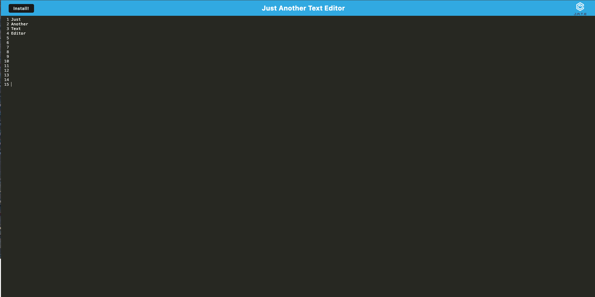

# PWA-Text-Editor

## License
  

  This project is licensed under the MIT license.
  
<a href= "https://choosealicense.com/licenses/mit/">link to MIT license</a>

## Description
This Application is a Text Editor that will let you create notes or code snippets with or without internet connection. So whenever you are ready for them you can always have them when you need them for later use.

## Table of Contents
- [License](#license)
- [Installation](#installation)
- [Usage](#usage)
- [Contributing](#contributing)
- [Tests](#tests)
- [Questions](#questions)

## Installation
npm install dependencies. npm run start to run server to test it.

## Usage
Deploy it in Heroku

## Contributing
Eric Reyna

## Tests
N/A

## Questions
For additional questions, you can reach me through:
- GitHub: [Ereyna21](https://github.com/Ereyna21)
- Email: Ereyna21075@gmail.com

Repository Link:

https://github.com/Ereyna21/PWA-Text-Editor

 

Deploy Link: 

https://pwa-text-editor-e21-9372dfcfeda3.herokuapp.com

